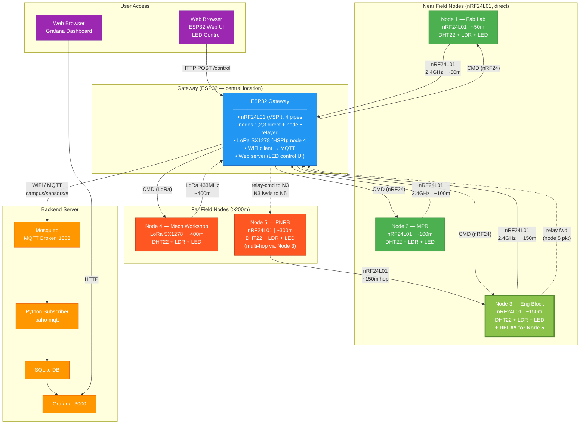

# Campus IoT Network Diagram

## Overview

5 field nodes across the Ashesi campus transmit temperature, humidity, and
light data to a central ESP32 gateway.

**Radio allocation (hardware available: 5× nRF24L01, 1× LoRa):**
- Nodes 1, 2, 3: nRF24L01, direct link to gateway
- Node 4 (Mech Workshop, ~400m): LoRa — longest distance, only LoRa module
- Node 5 (PNRB, ~300m): nRF24L01, **multi-hop via Node 3** (Eng Block)
  - Node 3 acts as a transparent relay: forwards Node 5 packets to gateway
    and relays LED commands from gateway back to Node 5

---

## Mermaid Network Diagram



---

## Multi-Hop Detail (Node 5 via Node 3)

```
Data path (up):
  Node 5 ──[nRF24, ~150m]──> Node 3 ──[nRF24, ~150m]──> Gateway
  (PNRB)                     (Eng Block, relay)            (ESP32)

Control path (down):
  Gateway ──[nRF24 relay-cmd]──> Node 3 ──[nRF24 fwd]──> Node 5
           ADDR_RELAY_CMD_BASE    (extracts dest+cmd)   ADDR_CMD_BASE+5
```

**Why Node 3 as relay:**
- Node 3 (Eng Block) is ~150m from gateway — solid direct nRF24 link
- PNRB is ~150m from Eng Block — another solid hop
- Total path ~300m in two hops vs. attempting 300m direct (unreliable indoors)
- Eng Block is likely mains-powered → relay stays awake (no deep sleep)

**Node 3 pipe map:**
| Pipe | Address | Purpose |
|------|---------|---------|
| TX | `ADDR_BASE + 3` | Own data → gateway |
| TX | `ADDR_BASE + 5` | Forwarded Node 5 data → gateway |
| TX | `ADDR_CMD_BASE + 5` | Forward LED cmd → Node 5 |
| RX 1 | `ADDR_CMD_BASE + 3` | LED cmd for itself from gateway |
| RX 2 | `ADDR_RELAY_BASE + 5` | Node 5 sensor data (to relay) |
| RX 3 | `ADDR_RELAY_CMD_BASE` | Relay-cmd from gateway (for Node 5) |

---

## MQTT Topics

| Topic | Direction | Payload | Description |
|---|---|---|---|
| `campus/sensors/{id}/temperature` | Node → Broker | float °C | Temperature |
| `campus/sensors/{id}/humidity` | Node → Broker | float % | Humidity |
| `campus/sensors/{id}/light` | Node → Broker | int 0-1023 | Light level |
| `campus/status/{id}` | Node → Broker | online/offline | Heartbeat |
| `campus/control/{id}/led` | Broker → Gateway → Node | ON/OFF | LED toggle |

---

## Node Summary

| Node | Location | Radio | Link to Gateway | Distance | Power |
|---|---|---|---|---|---|
| 1 | Fab Lab | nRF24L01 | Direct | ~50m | USB/mains |
| 2 | MPR | nRF24L01 | Direct | ~100m | Battery |
| 3 | Eng Block | nRF24L01 | Direct + **relay** | ~150m | Mains (relay needs awake) |
| 4 | Mech Workshop | LoRa SX1278 | Direct (LoRa) | ~400m | Battery |
| 5 | PNRB | nRF24L01 | **Via Node 3** | ~300m total | Battery |

---

## Firmware Flash Guide

| Node | Firmware folder | config.h setting to change |
|---|---|---|
| 1 | `firmware/field-node` | `NODE_ID 1` |
| 2 | `firmware/field-node` | `NODE_ID 2` |
| 3 | `firmware/field-node` | `NODE_ID 3` + uncomment `IS_RELAY_NODE` |
| 4 | `firmware/lora-node` | `NODE_ID 4` |
| 5 | `firmware/field-node` | `NODE_ID 5` + uncomment `VIA_RELAY` |
| GW | `firmware/gateway` | Set WiFi + MQTT broker IP |

---

## Data Packet Format (12 bytes)

```c
typedef struct {
    uint8_t  node_id;       // 1 byte
    float    temperature;   // 4 bytes — °C
    float    humidity;      // 4 bytes — %RH
    uint16_t light;         // 2 bytes — ADC 0-1023
    uint8_t  led_state;     // 1 byte
} SensorPacket;             // 12 bytes total

typedef struct {
    uint8_t dest_node_id;   // target node for the command
    uint8_t cmd;            // 1=ON, 0=OFF
} RelayCmd;                 // 2 bytes — used only on relay-cmd pipe
```
