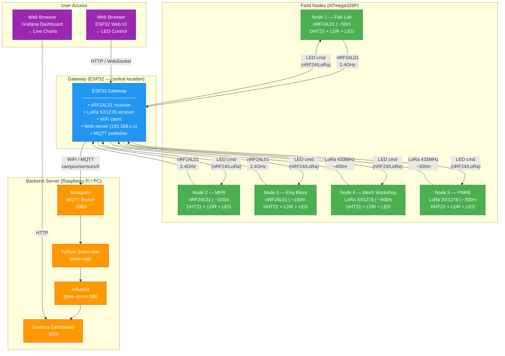

# Campus IoT Network Diagram

## Overview

5 field nodes (3 nRF24L01, 2 LoRa) across the Ashesi campus transmit
temperature, humidity, and light data to a central ESP32 gateway.
The gateway publishes via MQTT to a backend that stores and displays the data.
Bidirectional: the gateway can also push LED ON/OFF commands back to each node.

---

## Mermaid Network Diagram



---

## MQTT Topic Structure

| Topic | Direction | Payload | Description |
|---|---|---|---|
| `campus/sensors/{id}/temperature` | Node → Broker | `float` °C | Temperature reading |
| `campus/sensors/{id}/humidity` | Node → Broker | `float` % | Humidity reading |
| `campus/sensors/{id}/light` | Node → Broker | `int` 0-1023 | LDR raw ADC value |
| `campus/sensors/{id}/rssi` | Node → Broker | `int` dBm | Radio signal strength |
| `campus/control/{id}/led` | Broker → Gateway → Node | `ON` / `OFF` | LED toggle command |
| `campus/status/{id}` | Node → Broker | `online`/`offline` | Node heartbeat |

---

## Node Locations & Distances

| Node | Location | Radio | Est. Distance to Gateway | Battery / Power |
|---|---|---|---|---|
| 1 | Fab Lab | nRF24L01 | ~50m | USB / mains |
| 2 | MPR | nRF24L01 | ~100m | Battery pack |
| 3 | Engineering Block | nRF24L01 | ~150m | USB / mains |
| 4 | Mechanical Workshop | LoRa SX1278 | ~400m | Battery pack |
| 5 | PNRB | LoRa SX1278 | ~300m | Battery pack |

**Gateway:** positioned centrally (e.g., main admin area or library rooftop)

---

## Radio Link Budget

### nRF24L01 (PA+LNA module)
- Frequency: 2.4 GHz
- Tx Power: +20 dBm (PA version)
- Sensitivity: -95 dBm
- Expected range: 100–1000m (open field), 50–200m (through walls)
- Data rate: 250 kbps (long range mode)

### LoRa SX1278
- Frequency: 433 MHz
- Spreading Factor: SF10–SF12 for >300m indoors
- Tx Power: +20 dBm
- Expected range: 2–5 km (open), 300–800m (urban/indoor)

---

## Data Packet Format (C struct, 12 bytes)

```c
typedef struct {
    uint8_t  node_id;       // 1 byte  — node identifier (1–5)
    float    temperature;   // 4 bytes — °C
    float    humidity;      // 4 bytes — %RH
    uint16_t light;         // 2 bytes — ADC 0–1023
    uint8_t  led_state;     // 1 byte  — current LED state
} SensorPacket;             // Total: 12 bytes
```
