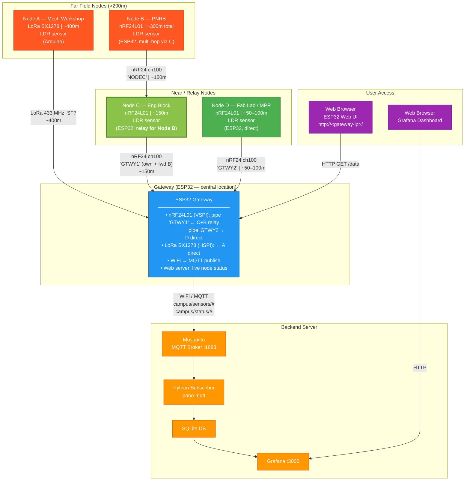

# Campus IoT Network Diagram

## Overview

4 ESP32 field nodes across the Ashesi campus transmit LDR (light) readings
to a central ESP32 gateway over nRF24L01 and LoRa SX1278.

**Radio allocation:**
- Node A (Mech Workshop, ~400m): LoRa SX1278 — longest range, direct to gateway
- Node B (PNRB, ~300m): nRF24L01, **multi-hop via Node C**
  - Node C (Eng Block) relays Node B packets to gateway and sends its own data
- Node D (Fab Lab / MPR, ~50–100m): nRF24L01, direct to gateway

---

## Mermaid Network Diagram



---

## Multi-Hop Detail (Node B via Node C)

```
Data path (up):
  Node B ──[nRF24, ch100, 'NODEC', ~150m]──> Node C ──[nRF24, 'GTWY1', ~150m]──> Gateway
  (PNRB)                                     (Eng Block, relay)                     (ESP32)

Node C also sends its own data:
  Node C ──[nRF24, 'GTWY1', ~150m]──> Gateway   (every 10 s, msg = "NodeC LDR:XXXX")
```

**Why Node C as relay:**
- Eng Block is ~150m from gateway — reliable direct nRF24 link
- PNRB is ~150m from Eng Block — another solid hop
- Total 300m in two reliable hops vs. single 300m direct (marginal indoors)
- Node C must stay powered (no deep sleep) to remain a live relay

---

## Gateway nRF24 Pipe Map

| Pipe | Address | Receives from |
|------|---------|---------------|
| 1 | `"GTWY1"` | Node C own data + Node B forwarded |
| 2 | `"GTWY2"` | Node D direct |

Node C internal pipe:
| Role | Address | Purpose |
|------|---------|---------|
| RX | `"NODEC"` | Receives Node B packets |
| TX | `"GTWY1"` | Forwards to gateway (own + Node B) |

---

## MQTT Topics

| Topic | Direction | Payload | Description |
|-------|-----------|---------|-------------|
| `campus/sensors/1/light` | Gateway → Broker | int 0–4095 | Node A LDR (LoRa) |
| `campus/sensors/2/light` | Gateway → Broker | int 0–4095 | Node B LDR (via relay) |
| `campus/sensors/3/light` | Gateway → Broker | int 0–4095 | Node C LDR (direct) |
| `campus/sensors/4/light` | Gateway → Broker | int 0–4095 | Node D LDR (direct) |
| `campus/status/{1–4}` | Gateway → Broker | online/offline | 2-min heartbeat |

---

## Node Summary

| Node | ID | Location | Radio | Link | Distance | Power | Send interval |
|------|----|----------|-------|------|----------|-------|---------------|
| A | 1 | Mech Workshop | LoRa SX1278 | Direct | ~400m | Battery | 10 s |
| B | 2 | PNRB | nRF24L01 | Via Node C relay | ~300m total | Battery | 10 s |
| C | 3 | Eng Block | nRF24L01 | Direct + relay | ~150m | Mains (relay stays awake) | 10 s |
| D | 4 | Fab Lab / MPR | nRF24L01 | Direct | ~50–100m | Battery | 30 s |
| GW | — | Central | — | WiFi | — | Mains | — |

---

## Firmware Flash Guide

| Node | Firmware folder | Board | Notes |
|------|----------------|-------|-------|
| A | `team-lora-node-a/` | Arduino Nano (ATmega328P) | LoRa SS=8, RST=7, DIO0=2; LDR=A0 |
| B | `team-node-b/` | ESP32 Dev Module | nRF24 CE=4, CSN=5; LDR=34 |
| C | `team-node-c-multihop/` | ESP32 Dev Module | nRF24 CE=4, CSN=5; LDR=34 — must not sleep |
| D | `team-node-c-direct-nrf/` | ESP32 Dev Module | nRF24 CE=4, CSN=5; LDR=34 |
| GW | `firmware/gateway/` | ESP32 Dev Module | Edit config.h for WiFi + MQTT IP |

---

## Message Format

All nodes transmit a plain ASCII string in a fixed 32-byte buffer:

```
"NodeA LDR:1234\0..."    ← Node A via LoRa
"NodeB LDR:567\0..."     ← Node B via Node C relay (nRF24)
"NodeC LDR:890\0..."     ← Node C own data (nRF24)
"NodeD LDR:1023\0..."    ← Node D direct (nRF24)
```

Gateway parses with `strncmp` (node ID) + `strstr("LDR:")` + `atoi` (value).

## Radio Settings (all nodes + gateway must match)

| Parameter | Value |
|-----------|-------|
| nRF24 channel | 100 |
| nRF24 data rate | 250 kbps |
| nRF24 PA level | LOW |
| LoRa frequency | 433 MHz |
| LoRa spreading factor | SF7 |
| LoRa bandwidth | 125 kHz |
| LoRa coding rate | 4/5 |
| LoRa sync word | library default |
